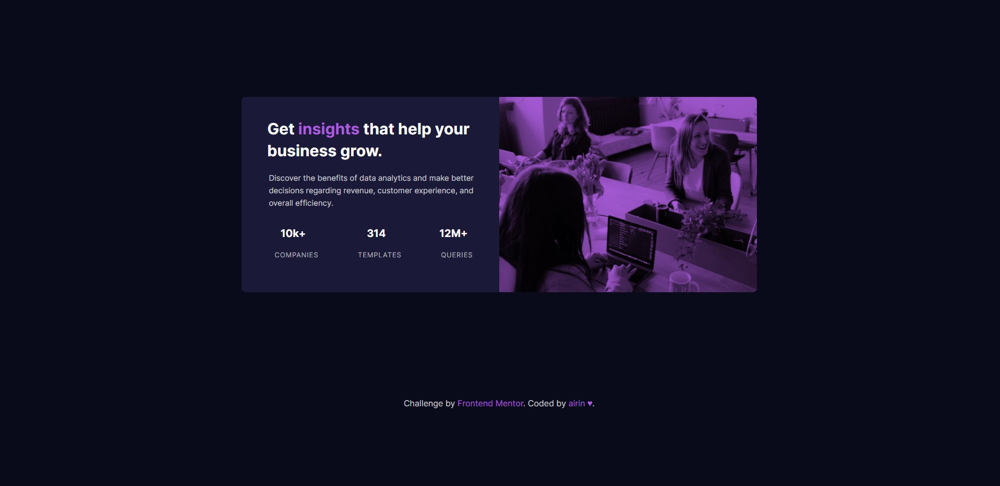

# Frontend Mentor - Stats preview card component solution

This is a solution to the [Stats preview card component challenge on Frontend Mentor](https://www.frontendmentor.io/challenges/stats-preview-card-component-8JqbgoU62). Frontend Mentor challenges help you improve your coding skills by building realistic projects. 

## Table of contents

- [Overview](#overview)
  - [The challenge](#the-challenge)
  - [Screenshot](#screenshot)
  - [Links](#links)
- [My process](#my-process)
  - [Built with](#built-with)
  - [What I learned](#what-i-learned)
  - [Continued development](#continued-development)
  - [Useful resources](#useful-resources)
- [Author](#author)
- [Acknowledgments](#acknowledgments)

**Note: Delete this note and update the table of contents based on what sections you keep.**

## Overview

### The challenge

Users should be able to:

- View the optimal layout depending on their device's screen size

### Screenshot

### Links

- Solution URL: [URL here](https://github.com/airin09/stats-preview-card-component-main)
- Live Site URL: [URL here](https://airin09.github.io/stats-preview-card-component-main/)

## My process

### Built with

- Semantic HTML5 markup
- CSS custom properties
- Flexbox
- CSS Grid
- Mobile-first workflow

### What I learned

I made this project using mobile first and the responsive design. I learned the use of @media queries.

### Continued development

### Useful resources

## Author

- Website - [airin09](https://github.com/airin09)
- Frontend Mentor - [@airin09](https://www.frontendmentor.io/profile/airin09)

## Acknowledgments

These two videos helped me so much for coding whis project:

- Bluuweb (https://www.youtube.com/watch?v=sR4R6H9s2Yw&ab_channel=Bluuweb)
- Mr Coder (https://www.youtube.com/watch?v=dhBR6-Jjql4&ab_channel=MrCoder)
